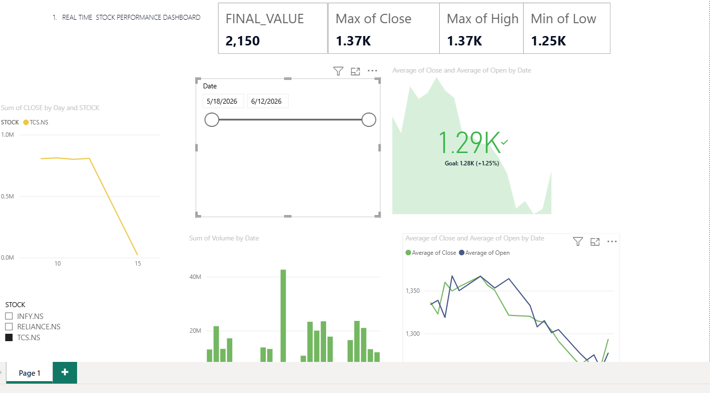

# 📈 Real-Time Stock Performance Dashboard

A Power BI dashboard tracking real-time stock performance for TCS, INFY, and RELIANCE stocks.

## 🔗 Live Dashboard
[Click here to view the live interactive dashboard](https://github.com/avneeshsinghbi-analytics/-stock-performance-dashboard-powerbi/blob/main/Stock-Dashboard.png)

## 📊 Features
- Real-time tracking of Close, Open, High, and Low values
- KPI cards showing Final Value, Max Close, Max High, Min Low
- Stock-wise filter slicer (TCS.NS, INFY.NS, RELIANCE.NS)
- Date range slider for custom time period analysis
- Volume trend by date (bar chart)
- Average Close vs Average Open trend line

## 🛠️ Tools Used
- Power BI Desktop
- DAX (Data Analysis Expressions)
- Power Query

## 📷 Screenshots

## 📁 Files
- [`STOCK DASHBOARD.pbix`](STOCK%20DASHBOARD.pbix) — full Power BI file (download to explore interactively)

## 📌 Data Source
Stock market data for NSE-listed companies (TCS, INFY, RELIANCE)

## 👤 Author
Avneesh Singh  
[LinkedIn](https://linkedin.com/in/avneesh-singh-example) | avneeshsingh@example.com
